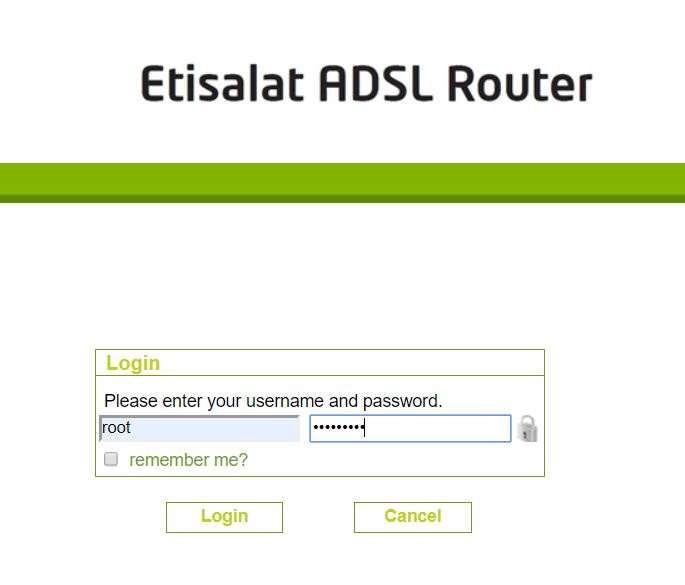
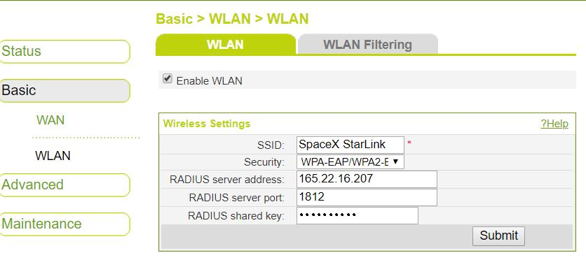
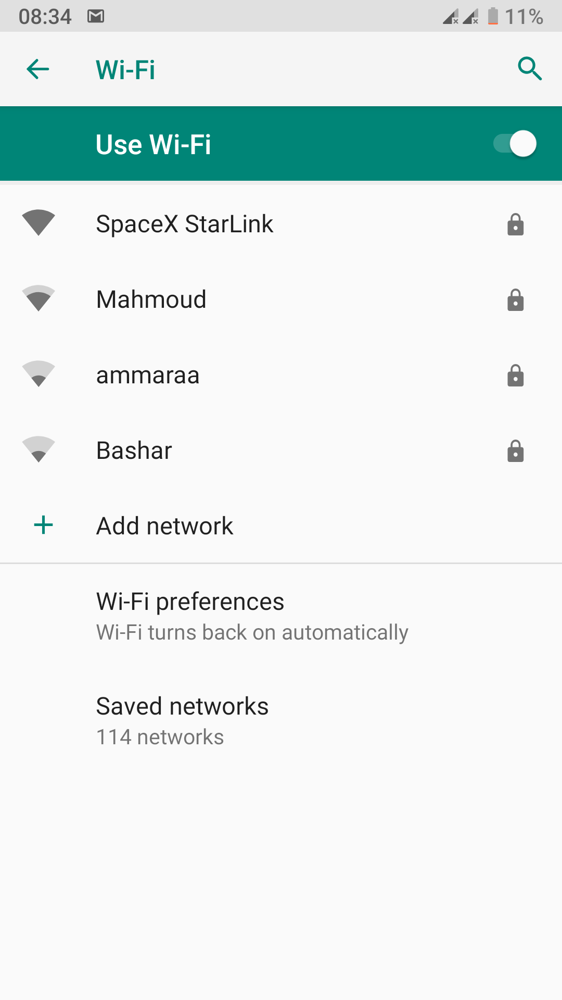
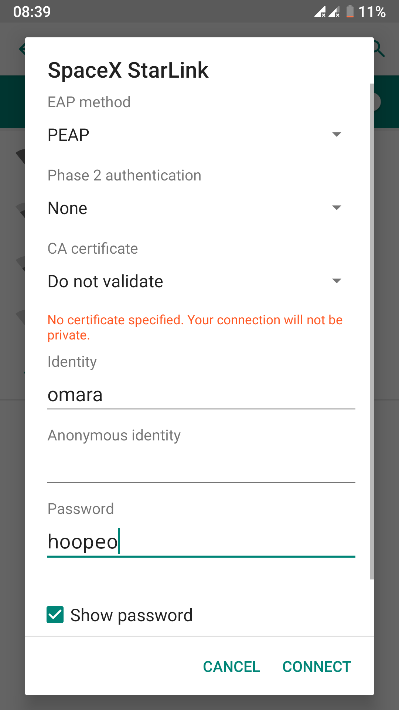

# RADIUS TASK#1 DOCS


## Table of Contents
* [Summary](#summary)
* [Example](#Example)

<a name="summary"></a>
## Summary
This task inteded to install, configure RADIUS on cloud VM and add usage policy on auth*ed users.

The **status of this task** can be found [HERE](https://trello.com/b/XNf6XnMI)

<a name="Example"></a>
## Example
### Follow this guied to add auth* ability to your NAS device (Home Gateway for example).

### Steps
1. Login to router configuration page

    

2. Under WLAN setting change to the following configuration:
    ```bash
    1. Security: 'WPA-EAP/WPA2-EAP'
    2. RADIUS server address: '165.22.16.207'
    3. RADIUS server port: '1812'
    4. RADIUS shared key: 'testing123'
    ```
    

3. Click `Submit` and you can reboot your router 

4. On any mobile device open WIFI settings and choose the network name.

    
5. Change the following configuration:
    ```bash
    EAP method: 'PEAP'
    CA certificate: 'Do not validate'
    Identity: 'omara'
    Password: 'hoopeo'
    ```
    
    
    then click `conntect`

Now your device should be connected to the Internet. If not consult your network adminstrator :)
